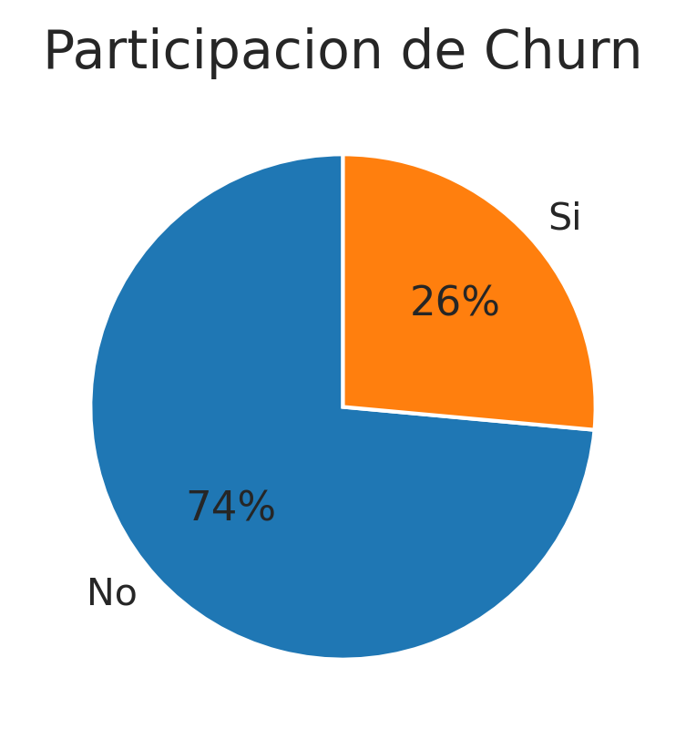

# Challenge Telecom X
#### OBJETIVO
Recopilar, procesar y analizar los datos, para extraer información valiosa. A partir de este análisis, el equipo de Data Science podrá avanzar en modelos predictivos y desarrollar estrategias para reducir la evasión.
<br/><br/>
#### ESTRUCTURA DEL PROYECTO
+ Extracción
+ Transformación
+ Carga y análisis
+ Informe final
<br>

#### INSTRUCCIONES DE EJECUCIÓN
El proyecto fue desarrollado en *Python* para ejecutarse en un entorno de *Google Colab*. El código está dividido en secciones que a su vez se dividen en bloques que siguen un orden secuencial de ejecución.<br/><br/>

#### EJEMPLO DE INSIGHT
Participación de variable objetivo (Churn): 26% fuga, 74% permanece.
<br/>
```python
plt.figure(figsize=(4, 3))
plt.pie(df['Churn'].value_counts(), labels=['No','Si'], autopct='%1.0f%%', startangle=90)
plt.title('Participacion de Churn', fontsize=14)
plt.show()
```

<br/>

> [!NOTE]
> El informe final se encuentra dentro del archivo *ipynb*.
